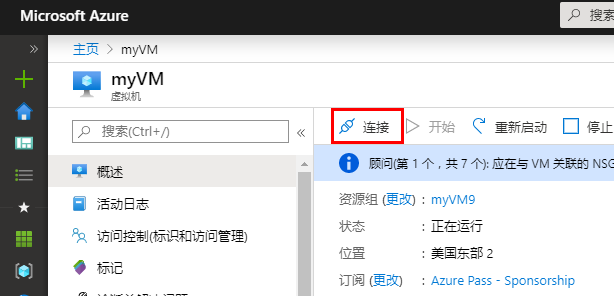
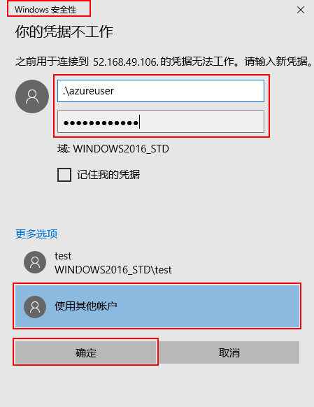

---
wts:
    title: '01 - 在门户中创建一个虚拟机（10 分钟）'
    module: '模块 02 - 核心 Azure 服务（工作负载）'
---
# 01 - 在门户中创建一个虚拟机

在本演练中，我们将在 Azure 门户中创建一个虚拟机，连接到该虚拟机，安装 Web 服务器角色并进行测试。 

**备注**：请在本演练中花些时间单击并阅读信息图标。 

# 任务 1：创建虚拟机（10 分钟）

在此任务中，我们将创建 Windows Server 2019 Datacenter Gen1 虚拟机。 

1. 登录至 [Azure 门户 (https://portal.azure.com)](https://portal.azure.com?azure-portal=true)。

2. 从 **“所有服务”** 边栏选项卡，搜索并选择 **“虚拟机”**，然后单击 **“+ 添加”** 并选择 **“+ 虚拟机”**。

3. 在 **“基本”** 选项卡上，填写以下信息（保留其他所有设置的默认值）：

    | 设置 | 值 |
    |  -- | -- |
    | 订阅 | **选择你的订阅**|
    | 资源组 | **myRGVM**（新建） |
    | 虚拟机名称 | **myVm** |
    | 位置 | **（美国）美国东部**|
    | 映像 | **Windows Server 2019 Datacenter - Gen1**|
    | 大小 | 标准 D2s v3|
    | 管理员帐户用户名 | **azureuser** |
    | 管理员帐户密码 | **Pa$$w0rd1234**|
    | 入站端口规则 - 允许选择端口 | **RDP (3389)** 和 **HTTP (80)**|
    | | |

4. 切换到“网络”选项卡，然后查找 **“选择入站端口”**：

    | 设置 | 值 |
    | -- | -- |
    | 选择入站端口 | **HTTP (80)、RDP (3389)**|
    | | |

    **注意** - 验证已选择端口 80 和 3389

5. 切换到“管理”选项卡，然后在其 **“监视”** 部分中选择以下设置：

    | 设置 | 值 |
    | -- | -- |
    | 引导诊断 | **禁用**|
    | | |

6. 保留其余默认值，然后单击页面底部的 **“查看 + 创建”** 按钮。

7. 验证通过后，单击 **“创建”** 按钮。部署虚拟机大约需要五到七分钟。

8. 你将在部署页面和通过 **“通知”** 区域（顶部菜单的钟形图标）收到更新。

* **验证已打开端口 80 和 3389**

# 任务 2：连接到虚拟机

在此任务中，我们将使用 RDP 连接到新虚拟机。 

1. 搜索 **“myVM”** 并选择新虚拟机。

    **备注**：也可以使用部署页面上的 **“前往资源”** 链接或 **“通知”** 区域中指向资源的链接。

2. 在虚拟机 **“概述”** 边栏选项卡上，单击 **“连接”** 按钮并选择 **“RDP”**。

    

    **备注**：以下说明介绍如何从 Windows 计算机连接到 VM。在 Mac 上，需要 RDP 客户端（例如 Mac App Store 中的此远程桌面客户端），而在 Linux 计算机上，可以使用开放源代码 RDP 客户端。

2. 在 **“连接到虚拟机”** 页面中，保留默认选项，以便通过端口 3389 使用公共 IP 地址进行连接，然后单击 **“下载 RDP 文件”**。

3. **打开**下载的 RDP 文件，并在出现提示时单击 **“连接”**。 

    

4. 在 **“Windows 安全”** 窗口中，选择 **“更多选项”**，然后选择 **“使用其他帐户”**。提供用户名 (.\azureuser) 和密码 (Pa$$w0rd1234)。单击 **“确定”** 进行连接。

    

5. 在登录过程中，你可能会收到证书警告。单击"**是**"或创建连接并连接到已部署的VM。你应该成功连接。

    

恭喜！你已在 Azure 中部署并连接到 Windows Server 虚拟机

# 任务 3：安装 Web 服务器角色并进行测试

在此任务中，我们将在服务器上安装 Web 服务器角色，并确保可以显示默认的 IIS 欢迎页面。

1. 通过以下步骤在虚拟机上打开 PowerShell 命令提示符：单击 **“开始”** 按钮，键入 **“PowerShell”**，右键单击 **“Windows PowerShell”**，然后在右键菜单中选择 **“以管理员身份运行”**。

    

2. 通过在 PowerShell 命令提示符中运行以下命令，在虚拟机中安装 **Web 服务器**功能。可以复制并粘贴此命令。

    ```PowerShell
    Install-WindowsFeature -name Web-Server -IncludeManagementTools
    ```
  
3. 完成后会看到一个值为 **“True”** 的提示符，指示 **“成功”**。你无需重启虚拟机即可完成安装。关闭与VM的RDP连接。

    

4. 返回门户，导航回 myVM 的 **“概述”** 边栏选项卡，然后使用 **“单击剪贴板”** 按钮复制 myVM 的公共 IP 地址，打开新的浏览器选项卡，将该公共 IP 地址粘贴到 URL 文本框中，然后按 **Enter** 键以浏览到它。

    

5. 随即将打开默认的 IIS Web 服务器欢迎页面。

    

恭喜！你已创建可通过公共 IP 地址访问的 Web 服务器。如果你有一个要托管的 Web 应用程序，则可以将这些应用程序文件部署到虚拟机并进行托管，以便在已部署的虚拟机上进行公共访问。


**备注**：为避免产生额外费用，你可以删除此资源组。搜索资源组，单击你的资源组，然后单击 **“删除资源组”**。验证资源组的名称，然后单击 **“删除”**。监视 **“通知”** 以查看删除是否成功完成。 
