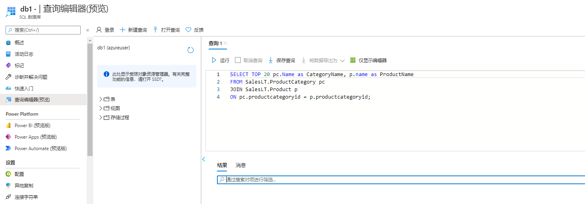
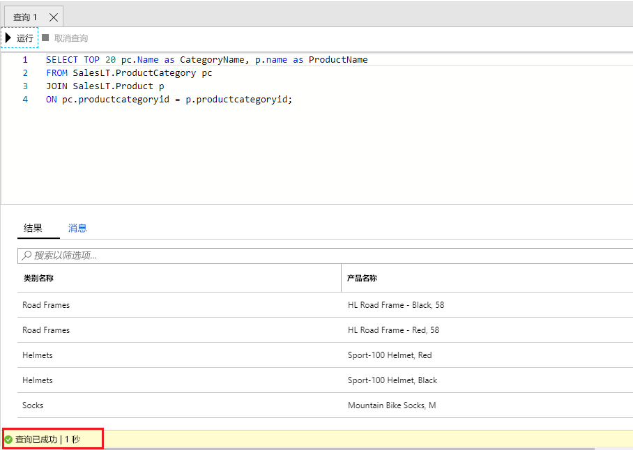

---
wts:
    title: '05 - 创建 SQL 数据库'
    module: '模块 02 - 核心 Azure 服务'
---

# 05 - 创建 SQL 数据库

在本演练中，我们将在 Azure 中创建一个 SQL 数据库，然后查询该数据库中的数据。

预计用时：25 分钟

# 任务 1：创建数据库

在此任务中，我们将使用 AdventureWorksLT 示例数据库创建一个新的 SQL 数据库。 

1. 登录 Azure 门户网站：<a href="https://portal.azure.com" target="_blank"><span style="color: #0066cc;" color="#0066cc">https://portal.azure.com</span></a>

2. 搜索并选择 **SQL 数据库**，然后单击 **+ 添加**。 

3. 在 **基本信息** 选项卡中，填写以下信息。  

    | 设置 | 数值 | 
    | --- | --- |
    | 订阅 | **选择你的订阅** |
    | 资源组 | **myRGDb** （新建） |
    | 数据库名| **db1** | 
    | | |

3. 在 **服务器** 旁边，单击 **新建** 并输入此信息。完成后，单击 **确定**。

    | 设置 | 数值 | 
    | --- | --- |
    | 服务器名称 | **sqlserverxxx** （必须是唯一的） | 
    | 服务器管理员登录： | **sqluser** |
    | 密码 | **Pa$$w0rd1234** |
    | 地点 | **(美国) 美国东部** |
    | 允许 Azure 服务访问服务器 | **选中框** |
    | | |

   

4. 移动至 **其他设置** 选项卡。我们将使用 AdventureWorksLT 示例数据库。

    | 设置 | 数值 | 
    | --- | --- |
    | 使用现有数据 | **示例** | 
    | | |

5. 单击 **查看 + 创建**，然后单击 **创建** 以部署和预配资源组、服务器和数据库。部署大约需要 2 到 5 分钟。

6. 监视你的部署。 

# 任务 2：测试数据库。

在此任务中，我们将配置 SQL Server 并运行 SQL 查询。 

1. 搜索 **SQL 数据库** 并确保已创建新数据库。你可能需要 **刷新** 页面。

    

2. 打开创建的 SQL 数据库 **db1**，然后选择 **查询编辑器(预览)**。

3. 使用密码 **Pa$$w0rd1234** 以 **sqluser** 身份登录。

4. 你将无法登录。请仔细阅读错误，并记下需要通过防火墙的 IP 地址。 

    

5. 搜索 **SQL Server**，选择你的 SQL Server。 

    

6. 从 SQL Server **概述** 边栏选项卡，单击 **显示防火墙设置**。

7. 单击 **添加客户端 IP** （顶部菜单栏），然后从错误页面添加 IP 地址。请务必 **保存** 更改。 

    

8. 返回你的 SQL 数据库和“查询编辑器(预览)”登录页面。尝试使用密码 **Pa$$w0rd1234** 以 **sqluser** 身份重新登录。此次应尝试成功。请注意，部署新的防火墙规则可能需要几分钟时间。 

9. 成功登录后，将出现查询窗格，在编辑器窗格中输入以下查询。

```SQL
SELECT TOP 20 pc.Name as CategoryName, p.name as ProductName
FROM SalesLT.ProductCategory pc
JOIN SalesLT.Product p
ON pc.productcategoryid = p.productcategoryid;
```

    

4. 选择 **运行**，然后在 **结果** 窗格中查看查询结果。查询应该成功运行。

    

恭喜！你已在 Azure 中创建了一个 SQL 数据库，并成功查询了该数据库中的数据。

**注意**：为避免产生额外费用，你可以删除此资源组。搜索资源组，单击你的资源组，然后单击 **删除资源组**。验证资源组的名称，然后单击 **删除**。关注 **通知**，了解删除操作的进度。