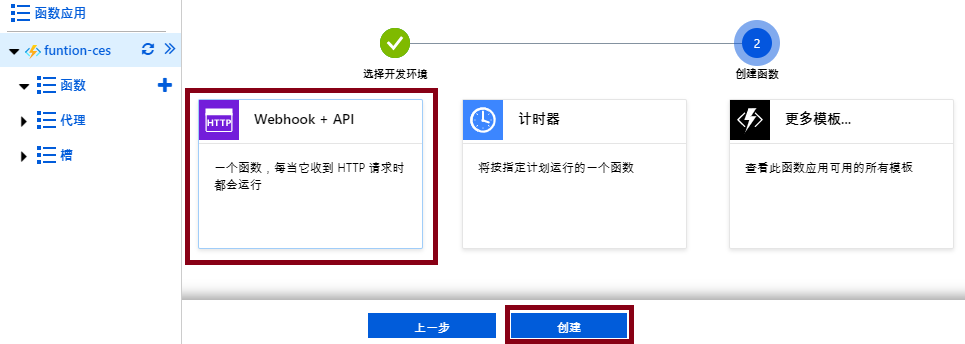
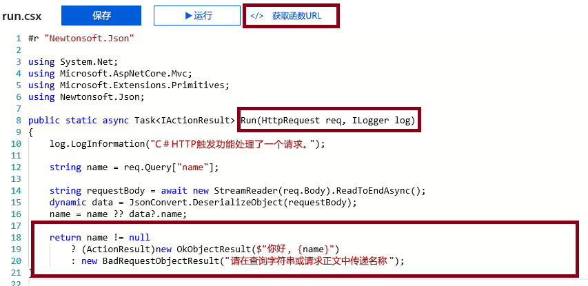
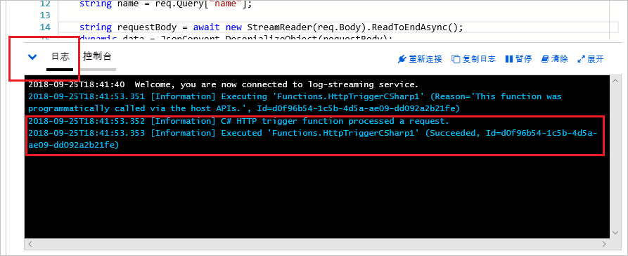

---
wts:
    title: '08 - 实现 Azure Functions（5 分钟）'
    module: '模块 03：描述核心解决方案和管理工具'
---
# 08 - 实现 Azure 函数

在本演练中，我们将创建一个函数应用，用于在出现 HTTP 请求时显示 Hello 消息。 

# 任务 1：创建函数应用（5 分钟）

在此任务中，我们将创建一个函数应用。

1. 登录到 [Azure 门户](https://portal.azure.com)。

1. 在门户顶部的 **“搜索资源、服务和文档”** 文本框中，搜索并选择 **“函数应用”**，然后在 **“函数应用”** 边栏选项卡中，单击 **“添加”**。

1. 在 **“函数应用”** 边栏选项卡的 **“基本信息”** 选项卡上，指定以下设置（将函数应用名称中的 **xxxx** 替换为字母和数字，使该名称在全局范围内唯一，并将所有其他设置保留为默认值）： 

    | 设置 | 值 |
    | -- | --|
    | 订阅 | Azure 订阅的名称 |
    | 资源组 | 新资源组的名称 **myRGFunction** |
    | 函数应用名称 | **function-xxxx** |
    | 发布 | **代码** |
    | 运行时堆栈 | **.NET Core** |
    | 版本 | **3.1** |
    | 区域 | **美国东部** |
    | | |

    **备注** - 请记住更改 **xxxx** 以使其成为唯一的 **函数应用名称**

1. 单击 **“查看 + 创建”**，然后在验证成功后，单击 **“创建”** 以开始预配和部署新的 Azure 函数应用。

1. 等待说明已创建资源的通知出现。

1. 导航回 **“函数应用”** 边栏选项卡，单击 **“刷新”** 并验证新创建的函数应用是否具有 **“正在运行”** 状态。 

    

# 任务 2：创建一个 HTTP 触发的函数并对其进行测试

在此任务中，我们将使用 Webhook + API 函数，用于在出现 HTTP 请求时显示消息。 

1. 在 **“函数应用”** 边栏选项卡上，单击新创建的函数应用。 

1. 在 **“函数应用”** 边栏选项卡的 **“函数”** 部分，单击 **“函数”**，然后单击 **“添加”**。

    

1. 在“新建函数”边栏选项卡的 **“模板”** 选项卡上，单击 **“HTTP 触发器”**。 

    

1. 在 **“新建函数”** 边栏选项卡的 **“详细信息”** 选项卡上，接受默认的 **新函数** 名称和 **授权级别**，然后单击 **“创建函数”**。 

    

1. 在 **HttpTrigger1** 边栏选项卡的 **“开发人员”** 部分，单击 **“编码 + 测试”**。 

1. 在 **“HttpTrigger1\| 编码 + 测试”** 边栏选项卡上，查看自动生成的代码，并注意该代码旨在运行 HTTP 请求和日志信息。另请注意，该函数将返回包含名称的 Hello 消息。 

    

1. 在函数编辑器顶部单击 **“获取函数 URL”**。 

1. 请确保 **“密钥”** 下拉列表中的值设置为默认值，并单击 **“复制”** 以复制函数 URL。 

    

1. 打开一个新的浏览器标签页，并将复制的函数 URL 粘贴到 Web 浏览器的地址栏中。当请求该页面时，该函数将运行。请注意，返回的消息会指出函数需要请求正文中的名称。

    

1. 将 **&name=*yourname*** 附加到 URL 的末尾。

    **备注**：将 ***yourname*** 替换为你的名字。例如，如果你的名字是 Cindy，则最终 URL 将类似于 `https://azfuncxxx.azurewebsites.net/api/HttpTrigger1?code=X9xx9999xXXXXX9x9xxxXX==&name=cindy`

    

1. 函数运行时，会跟踪每次调用。要在 Azure 门户中查看跟踪，请返回 **“HttpTrigger1\| 编码 + 测试”** 边栏选项卡，并单击 **“监视”**。

    

恭喜！你已创建一个函数应用，当出现 HTTP 请求时，它会显示 Hello 消息。 

**备注**：为避免产生额外费用，你可以删除此资源组。搜索资源组，单击你的资源组，然后单击 **“删除资源组”**。验证资源组的名称然后单击 **“删除”**。关注 **“通知”**，了解删除操作的进度。
