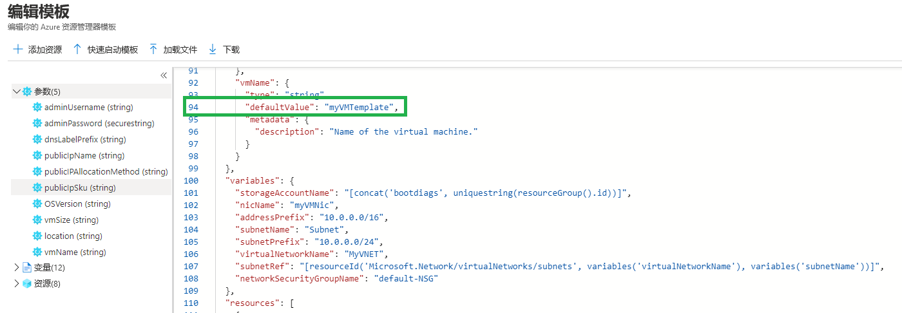
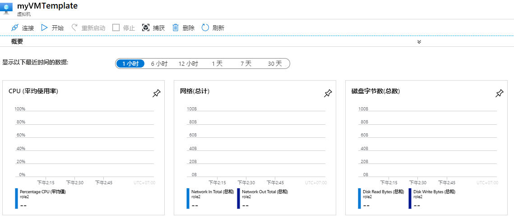

---
wts:
    title: '09 - 使用模板创建 VM'
    module: '模块 02 - 核心 Azure 服务'
---
# 09 - 使用模板创建 VM

在本演练中，我们将使用快速启动模板部署虚拟机并检查监视功能。

预计用时：30 分钟

# Task1：了解库并找到模板

在此任务中，我们将浏览 Azure 快速入门库并部署模板以创建虚拟机。 

1. 在浏览器中，访问 [Azure 快速启动模板库](https://azure.microsoft.com/resources/templates?azure-portal=true)。 在库中，你将找到许多最近更新的热门模板。这些模板可用于 Azure 资源和常用软件包。

2. 浏览多种不同类型的可用模板。是否有你感兴趣的模板？

3. 搜索或直接访问[部署简单的 Windows VM](https://azure.microsoft.com/resources/templates/101-vm-simple-windows?azure-portal=true) 模板。

    **注意**： **部署到 Azure** 按钮使你能够将模板直接部署到 Azure 门户。请注意，此模板仅提示你输入少量配置参数。 

4. 单击 **部署到 Azure** 按钮。 

5. 单击 **编辑模板**。资源管理器模板格式为 JSON。浏览参数并找到虚拟机名称。将名称更改为 **myVMTemplate**。**保存** 更改。

    

6. 配置模板参数。 

	| 设置| 数值|
	|----|----|
	| 订阅 | **选择你的订阅**|
	| 资源组 | **myRGTemplate** （新建） |
	| 管理员用户名 | **azureuser** |
	| 管理员密码 | **Pa$$w0rd1234** |
	| DNS 标签前缀 | **myvmtemplatexxx** （这必须是唯一的） |
	| Windows OS 版本 | **2016-Datacenter** |
   	| | |

7. 选中 **我同意上述条款和条件**。框，然后单击 **购买**。

    **注意**：此模板不收取任何费用。

8. 监视你的部署。 

# 任务 2：验证和监视虚拟机部署

在此任务中，我们将验证虚拟机是否已正确部署。 

1. 搜索并选择 **虚拟机**。

2. 确保已创建新的虚拟机。 

    

3. 选择你的虚拟机，然后在 **概述** 窗格向下滚动以查看监视数据。

4. 请注意，时间范围可以在 1 小时和 30 天之间进行调整。

5. 请注意提供的不同图形，包括 **CPU（平均值）**、**网络（总计）** 和 **磁盘字节（总计）**。 

    

6. 单击任何图形。注意，你可以 **添加指标** 并更改图表类型。如有时间，请尝试。 

7. 返回 **概述** 边栏选项卡。

8. 单击 **活动日志**（左窗格）。活动日志会记录创建或修改资源的时间。 

9. 单击 **添加筛选器**，并尝试搜索其他事件类型和操作。 

    

**注意**：为避免产生额外费用，你可以删除此资源组。搜索资源组，单击你的资源组，然后单击 **删除资源组**。验证资源组的名称，然后单击 **删除**。关注 **通知**，了解删除操作的进度。