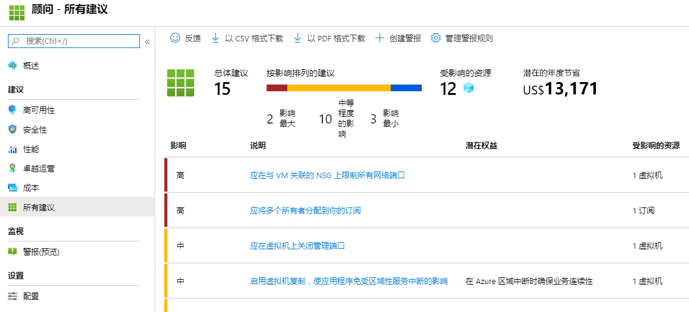

---
wts:
    title: '10 - 使用 PowerShell 创建 VM'
    module: '模块 02 - 核心 Azure 服务'
---
# 10 - 使用 PowerShell 创建 VM

在本演练中，我们将在本地安装 PowerShell、创建资源组和虚拟机、访问和使用 Cloud Shell，以及查看 Azure 顾问建议。 

预计用时：35 分钟

# 任务 1：在本地配置 PowerShell

在此任务中，我们将配置 PowerShell 以在本地计算机上运行。 

1. 从本地计算机上的任务栏中选择 **开始** 图标。键入 **PowerShell** 并找到 **Windows PowerShell 应用**。右键单击该应用，然后选择 **以管理员身份运行**。如果出现提示，请回答 **是** 以信任该应用。 

    **注意：**对于 Linux 和 macOS，可以使用以下命令通过提升的权限启动 PowerShell Core。

```bash
sudo pwsh
```

2. 在 PowerShell 提示符处，安装 Azure PowerShell 模块。如果出现提示，请回答 **全部是** 以信任存储库。完成安装可能需要几分钟时间。

```PowerShell
Install-Module Az -AllowClobber
```

    **注意**：如果出现提示，Windows 用户应同意安装 *NuGet* 提供程序，并同意从 *PowerShell 库* (PSGallery) 安装模块。如果收到 脚本执行失败，在提升的 PowerShell 会话中运行 `Set-ExecutionPolicy RemoteSigned`。 

3. 获取最新的 Az 模块更新。 

```PowerShell
Update-Module -Name Az
```

    **注意：**如果出现提示，请回答 **全部是** 以信任 Az 模块的更新。如果你已安装最新版本的 Az 模块，则会自动返回提示。

# 任务 2：创建资源组和虚拟机

在此任务中，我们将使用 PowerShell 创建资源组和虚拟机。  

1. 从本地计算机连接到 Azure，并在出现提示时提供 Azure 登录凭据。查看返回的订阅和帐户信息。 

```PowerShell
Connect-AzAccount
```

2. 创建新资源组。 

```PowerShell
New-AzResourceGroup -Name myRGPS -Location EastUS
```

3. 验证你的新资源组。 

```PowerShell
Get-AzResourceGroup | Format-Table
```

4. 创建虚拟机。出现提示时，为新计算机提供名称 (**myVMPS**)、用户名 (**azureuser**) 和密码 (**Pa$$w0rd1234**)。请确保在一行上输入命令。并且，当它们全部位于一行时，不应有任何反引号 (`)。 

```PowerShell
    New-AzVm `
    -ResourceGroupName "myRGPS" `
    -Name "myVMPS" `
    -Location "East US" `
    -VirtualNetworkName "myVnetPS" `
    -SubnetName "mySubnetPS" `
    -SecurityGroupName "myNSGPS" `
    -PublicIpAddressName "myPublicIpPS" `
```

5. 登录至 [Azure 门户](https://portal.azure.com)。

6. 搜索 **虚拟机** 并验证 **myVMPS** 是否正在运行。这可能需要几分钟时间。

    

7. 访问新虚拟机并查看“概述”和“网络”设置，以验证是否已正确部署你的信息。 

8. 关闭本地 PowerShell 会话。 

# 任务 3：在 Cloud Shell 中执行命令

在此任务中，我们将练习从 Cloud Shell 执行 PowerShell 命令。 

1. 单击 Azure 门户右上方的图标，从门户打开 **Azure Cloud Shell**。

    

2. 如果你之前使用过 Cloud Shell，请跳至步骤 5。 

3. 当提示你选择 **Bash** 或 **PowerShell** 时，选择 **PowerShell**。 

4. 出现提示时，选择 **创建存储** ，并允许 Azure Cloud Shell 初始化。 

5. 确保在左上方的下拉菜单中选中 **PowerShell**。

6. 检索有关你的虚拟机的信息，包括名称、资源组、位置和状态。注意 PowerState 为 **正在运行**。

```PowerShell
Get-AzVM -name myVMPS -status | Format-Table -autosize
```

7. 停止虚拟机。出现提示时，确认（选择“是”）该操作。 

```PowerShell
Stop-AzVM -ResourceGroupName myRGPS -Name myVMPS
```

8. 验证你的虚拟机状态。PowerState 现在应为 **解除分配**。你还可以在门户中验证虚拟机状态。 

```PowerShell
Get-AzVM -name myVMPS -status | Format-Table -autosize
```

# 任务 4：查看 Azure 顾问建议

**注意：**使用 Azure CLI 创建 VM 过程中存在同样的任务。 

在此任务中，我们将查看虚拟机的 Azure 顾问建议。 

1. 在门户中，搜索并选择 **顾问**。 

2. 在顾问中，选择 **概述**。请注意，建议按高可用性、安全性、性能和费用进行分组。 

    

3. 选择 **所有建议** 并花一些时间查看每个建议和建议的操作。 

    **注意：**建议会根据资源情况而有所不同。 

    

4. 请注意，可将建议下载为 CSV 或 PDF 文件。 

5. 请注意，你可以创建警报。 

6. 如有时间，请继续尝试使用 Azure PowerShell。 

恭喜！你已在本地计算机上安装了 PowerShell，使用 PowerShell 创建了虚拟机，使用 PowerShell 命令进行了练习，并查看了顾问建议。

**注意**：为避免产生额外费用，你可以删除此资源组。搜索资源组，单击你的资源组，然后单击 **删除资源组**。验证资源组的名称，然后单击 **删除**。关注 **通知**，了解删除操作的进度。