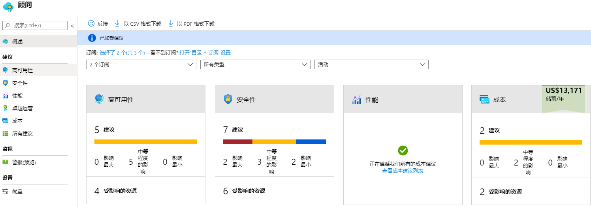

---
wts:
    title: '10 - 使用 PowerShell 创建 VM（10 分钟）'
    module: '模块 03：描述核心解决方案和管理工具'
---
# 10 - 使用 PowerShell 创建 VM

在本演练中，我们将配置 Cloud Shell，使用 Azure PowerShell 模块创建资源组和虚拟机，并查看 Azure 顾问建议。 

# 任务 1：配置 Cloud Shell（10 分钟）

在此任务中，我们将配置 Cloud Shell。 

1. 登录到 [Azure 门户](https://portal.azure.com)。

2. 单击 Azure 门户右上方的图标，在 Azure 门户中打开 **Azure Cloud Shell**。

    

3. 如果你之前使用过 Cloud Shell，请继续执行下一个任务。 

4. 当提示你选择 **“Bash”** 或 **“PowerShell”** 时，选择 **“PowerShell”**。

5. 当系统出现提示时，选择 **“创建存储”**，并等待 Azure Cloud Shell 初始化。 

# 任务 2：创建资源组和虚拟机

在此任务中，我们将使用 PowerShell 创建资源组和虚拟机。  

1. 确保在 “Cloud Shell” 窗格左上方的下拉菜单中选中 **“PowerShell”**。

2. 在 PowerShell 会话的 Cloud Shell 窗格中，创建新的资源组。 

    ```PowerShell
    New-AzResourceGroup -Name myRGPS -Location EastUS
    ```

3. 验证你的新资源组。 

    ```PowerShell
    Get-AzResourceGroup | Format-Table
    ```

4. 创建虚拟机。当系统出现提示时，提供将被配置为该虚拟机上的本地管理员帐户的用户名 (**azureuser**) 和密码 (**Pa$$w0rd1234**)。确保在最后一行以外的每行末尾添加反引号 (`) 字符（如果在一行上键入整个命令，则不应包含任何反引号字符）。

    ```PowerShell
    New-AzVm `
    -ResourceGroupName "myRGPS" `
    -Name "myVMPS" `
    -Location "East US" `
    -VirtualNetworkName "myVnetPS" `
    -SubnetName "mySubnetPS" `
    -SecurityGroupName "myNSGPS" `
    -PublicIpAddressName "myPublicIpPS"
    ```
** 等待 VM 部署完成后再关闭 PowerShell

5. 关闭 PowerShell 会话 Cloud Shell 窗格。

6. 在 Azure 门户中，搜索 **“虚拟机”** 并验证 **myVMPS** 是否正在运行。这可能需要几分钟时间。

    

7. 访问新虚拟机并查看“概述”和“网络”设置，以验证是否已正确部署你的信息。 

# 任务 3：在 Cloud Shell 中执行命令

在此任务中，我们将练习从 Cloud Shell 执行 PowerShell 命令。 

1. 单击 Azure 门户右上方的图标，在 Azure 门户中打开 **Azure Cloud Shell**。

2. 确保在“Cloud Shell”窗格左上方的下拉菜单中选中 **“PowerShell”**。

3. 检索有关你的虚拟机的信息，包括名称、资源组、位置和状态。注意 PowerState 为 **“正在运行”**。

    ```PowerShell
    Get-AzVM -name myVMPS -status | Format-Table -autosize
    ```

4. 停止虚拟机。出现提示时，确认（选择“是”）该操作。 

    ```PowerShell
    Stop-AzVM -ResourceGroupName myRGPS -Name myVMPS
    ```

5. 验证你的虚拟机状态。PowerState 现在应为 **“解除分配”**。你还可以在门户中验证虚拟机状态。 

    ```PowerShell
    Get-AzVM -name myVMPS -status | Format-Table -autosize
    ```

# 任务 4：查看 Azure 顾问建议

**备注：** 使用 Azure CLI 实验室创建 VM 过程中存在同样的任务。 

在此任务中，我们将查看虚拟机的 Azure 顾问建议。 

1. 从 **“所有服务”** 边栏选项卡，搜索并选择 **“顾问”**。 

2. 在 **“顾问”** 边栏选项卡中，选择 **“概述”**。请注意，建议按高可用性、安全性、性能和费用进行分组。 

    

3. 选择 **“所有建议”** 并花一些时间查看每个建议和建议的操作。 

    **备注：** 建议会根据资源情况而有所不同。 

    

4. 请注意，可将建议下载为 CSV 或 PDF 文件。 

5. 请注意，你可以创建警报。 

6. 如有时间，请继续尝试使用 Azure PowerShell。 

恭喜！你已配置了 Cloud Shell，使用 PowerShell 创建了虚拟机，使用 PowerShell 命令进行了练习，并查看了顾问建议。

**备注**：为避免产生额外费用，你可以删除此资源组。搜索资源组，单击你的资源组，然后单击 **“删除资源组”**。验证资源组的名称，然后单击 **“删除”**。关注 **“通知”**，了解删除操作的进度。
