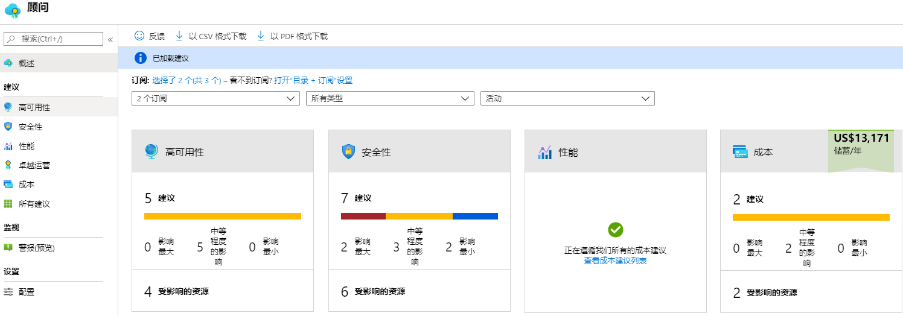

---
wts:
    title: '11 - 使用 CLI 创建 VM'
    module: '模块 02 - 核心 Azure 服务'
---
# 11 - 使用 CLI 创建 VM

在本演练中，我们将在本地安装 Azure CLI、创建资源组和虚拟机、使用 Cloud Shell，以及查看 Azure 顾问建议。 

预计用时：35 分钟

**注意**：以下步骤基于 Windows 安装，但它们同样适用于 Mac 或 Linux 环境。但是，[每个环境都有特定的安装步骤](https://docs.microsoft.com/cli/azure/install-azure-cli)。

# 任务 1：在本地安装 CLI

在此任务中，我们将在本地计算机上安装 Azure CLI。 

1. 下载 [Azure CLI MSI](https://aka.ms/installazurecliwindows)，然后在浏览器中选择 **运行**。下载文件将需要一分钟时间。

2. 在 Microsoft Azure CLI 安装向导中，单击 **我接受许可协议中的条款** 框，然后单击 **安装**。

3. 在 **用户帐户控制** 对话框中，选择 **是** 指示该应用可以对你的设备进行更改。 

4. 安装完成后，选择 **完成**。

    **注意：**运行 Azure CLI 的方法是在 Linux 或 macOS 中打开 Bash shell，也可以从命令提示符处或 Windows 中的 PowerShell 应用来运行它。 

# 任务 2：创建资源组和虚拟机

1. 在本地计算机上打开一个 **命令提示符**。请务必 **以管理员身份运行**。如果出现提示，请确认（选择“是”）应用可以对你的设备进行更改。

    **注意**：可以从 PowerShell 会话而不是从 Windows 命令提示符处运行 Azure CLI。从 PowerShell 运行 CLI 具有一些优点，例如更多的选项卡完成功能。

2. 登录到你的 Azure 订阅。选择与你的订阅关联的帐户，然后等待登录成功。 

```azurecli
az login
```

3. 如果愿意，可以将 [Azure CLI 文档](https://docs.microsoft.com/zh-cn/cli/azure/?view=azure-cli-latest) 页面添加为书签。

4. 通过运行版本检查命令验证安装并确保其成功运行。出现有关无法检查最新更新的警告消息是没有问题的。 

```cli
az --version
```

5. 创建新资源组。

```cli
az group create --name myRGCLI --location EastUS
```

6. 验证是否已创建资源组。

```cli
az group list --output table
```

7. 创建一个新虚拟机。此命令必须全部在一行。并且，当它们全部位于一行时，不应有任何反引号 (`)。 


```cli
    az vm create `
        --name myVMCLI `
        --resource-group myRGCLI `
        --image UbuntuLTS `
        --location EastUS `
        --admin-username azureuser `
        --admin-password Pa$$w0rd1234
```

    **注意**：该命令将需要 2 至 3 分钟才能完成。该命令将创建一个虚拟机以及与之关联的各种资源，例如存储、网络和安全资源。在虚拟机部署完成之前，请勿继续进行下一步。完成后，你可以关闭 Azure Cloud Shell。


8. 命令运行完成后，请登录到 [Azure 门户](https://portal.azure.com)。

9. 搜索 **虚拟机** 并验证 **myVMCLI** 是否正在运行。

    

10. 关闭本地 CLI 会话。 

# 任务 3：在 Cloud Shell 中执行命令

在此任务中，我们将练习从 Cloud Shell 执行 CLI 命令。 

1. 单击 Azure 门户右上方的 **Azure Cloud Shell** 图标，从门户中打开 *Azure Cloud Shell*。

    

2. 如果你之前使用过 Cloud Shell，请跳至步骤 5。 

3. 当提示你选择 **Bash** 或 **PowerShell** 时，选择 **Bash**。 

4. 出现提示时，选择 **创建存储**，并允许 Azure Cloud Shell 初始化。 

5. 确保在左上方的下拉菜单中选中 **Bash**。

**请注意，使用 Shell 时无需登录。**

6. 检索有关你的虚拟机的信息，包括名称、资源组、位置和状态。注意 PowerState 为 **正在运行**。

```cli
az vm show --resource-group myRGCLI --name myVMCLI --show-details --output table 
```

7. 停止虚拟机。请注意提示在虚拟机解除分配之前都将继续计费的消息。 

```cli
az vm stop --resource-group myRGCLI --name myVMCLI
```

8. 验证你的虚拟机状态。PowerState 现在应为 **已停止**。

```cli
az vm show --resource-group myRGCLI --name myVMCLI --show-details --output table 
```

# 任务 4：查看 Azure 顾问建议

在此任务中，我们将查看 Azure 顾问建议。 

    **注意：**如果已完成上一个实验（使用 PowerShell 创建 VM），那么就已完成此任务。 

1. 在门户中，搜索并选择 **顾问**。 

2. 在顾问中，选择 **概述**。请注意，建议按高可用性、安全性、性能和费用进行分组。 

    

3. 选择 **所有建议** 并花一些时间查看每个建议和建议的操作。 

    **注意：**建议会根据资源情况而有所不同。 

    

4. 请注意，可将建议下载为 CSV 或 PDF 文件。 

5. 请注意，你可以创建警报。 

6. 如有时间，请继续尝试使用 Azure CLI。

恭喜！你已在本地计算机上安装了 PowerShell，使用 PowerShell 创建了虚拟机，使用 PowerShell 命令进行了练习，并查看了顾问建议。

**注意**：为避免产生额外费用，你可以删除此资源组。搜索资源组，单击你的资源组，然后单击 **删除资源组**。验证资源组的名称，然后单击 **删除**。关注 **通知**，了解删除操作的进度。

