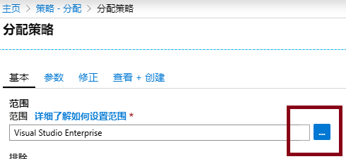
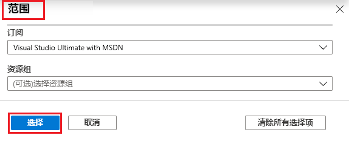
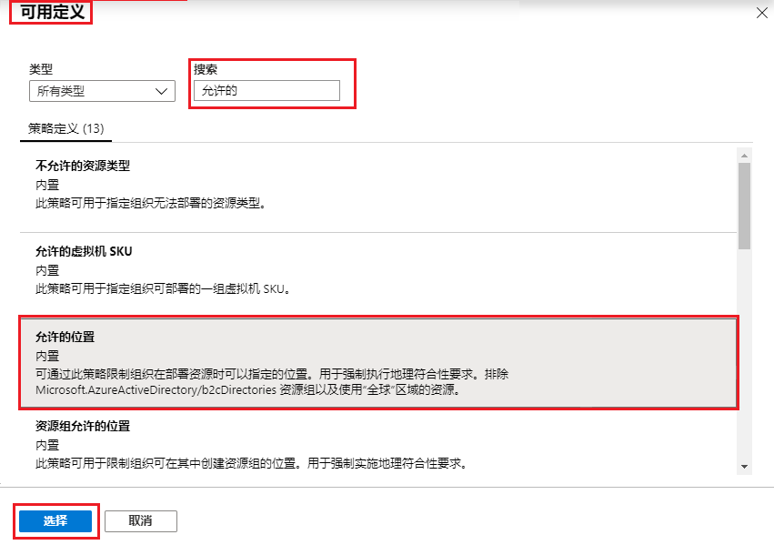

---
wts:
    title: '17 - 创建 Azure Policy（10 分钟）'
    module: '模块 05：介绍标识、治理、隐私和合规性功能'
---
# 17 - 创建 Azure Policy

在本演练中，我们将创建一个 Azure Policy，以将 Azure 资源的部署限制到特定位置。

# 任务 1：创建策略分配（10 分钟）

在此任务中，我们将配置“允许的位置”策略并将其分配给我们的订阅。 

1. 登录至 [Azure 门户](https://portal.azure.com)。

2. 搜索并选择 **策略**，在 **创作** 部分下单击 **定义**。  花一点时间查看内置策略定义列表。例如，在 **类别** 下拉列表中，仅选择 **计算**。注意，利用 **允许的虚拟机 SKU** 定义，可以指定组织可以部署的一组虚拟机 SKU。

3. 返回到 **策略** 页面，在 **创作** 部分下单击 **分配**。分配是将策略分配到特定范围。例如，可以将定义分配给订阅范围。 

4. 在 **策略 - 分配** 页面的顶部，选择 **分配策略**。

5. 在 **分配策略** 页面上，通过单击省略号选择范围选择器。

    

6. 确保已选择你的订阅。你的订阅将有所不同。注意，可以选择将策略范围限定为资源组。保留默认值，然后单击 **选择**。 

    **注意**：范围确定要强制执行策略分配的资源或资源组。在本例中，我们可以将此策略分配给特定的资源组，但我们将在订阅级别分配该策略。另外，请注意，可以根据范围排除资源。排除是可选的。

    

7. 选择 **策略定义** 省略号按钮。  在 **搜索** 框中，键入 **位置**，然后单击 **允许的位置** 定义，然后单击 **选择**。

    **注意**：这个 **允许的位置** 策略定义将指定所有资源必须部署到的位置。如果选择其他位置，将不允许部署。有关更多信息，请参阅 [Azure 策略示例](https://docs.microsoft.com/zh-cn/azure/governance/policy/samples/index) 页面。

   

8.  在 **分配策略** 窗格中的 **参数** 选项卡中，单击 **允许的位置** 框末尾的箭头，然后在随后的列表中选择 **日本西部**。保留所有其他值不变，然后单击 **审阅+保存**，之后再单击 **保存**。

    

9.  **允许的位置** 策略分配现在列于 **策略 - 分配** 窗格上，它现已设置好并且可以在我们指定的范围级别（订阅级别）强制执行。

# 任务 2：测试“允许的位置”策略

在此任务中，我们将测试“允许的位置”策略。 

1. 在 Azure 门户中，搜索并选择 **存储帐户**，然后单击 **+添加**。

2. 配置存储帐户。对于其他设置，请采用默认值。 

    | 设置 | 数值 | 
    | --- | --- |
    | 订阅 | **使用你的订阅** |
    | 资源组 | **myRGPolicy** （新建） |
    | 存储帐户名称:  | **storageaccountxxx** （必须是唯一的） |
    | 地点 | **（美国）美国东部** |
    | | |

3. 单击 **审阅+创建**。

4. 你将收到验证失败消息，然后单击 **点击此处以查看详细信息** 消息。在生成的 **错误** 边栏选项卡中的 **摘要** 选项卡上，请注意 **策略禁止资源 xyz** 错误消息，并且策略名称列为 **允许的位置**

# 任务 3：删除策略分配

在此任务中，我们将删除“允许的位置”策略分配并进行测试。 

我们将删除策略分配，以确保不会妨碍我们以后想要执行的任何工作。

1. 在门户中，搜索并选择 **策略**，然后单击 **允许的位置** 策略。

    **备注**：在“策略”边栏选项卡上，你可以查看已分配的各种策略的合规性状态。

    **注意**：“允许的位置”策略可能会显示不合规的资源。如果出现这种情况，则这些资源是在策略分配之前创建的。

2. 在顶部菜单中选择 **删除分配**。

   

3. 通过单击 **是**，确认你希望删除 **删除分配** 对话框中的策略分配

4. 尝试创建另一个存储帐户，确保该策略不再有效。

    **注意**： **允许的位置** 策略适用于以下场景： 
    - *成本跟踪*：你可能在不同的区域位置有不同的订阅，确保所有资源都部署在该区域中有助于成本跟踪。 
    - *数据驻留和安全合规*：你还可能具有数据驻留要求，按客户或特定的工作负荷创建订阅并定义所有资源必须部署在特定的数据中心可确保数据和安全合规要求。

恭喜！你已创建一个 Azure Policy，用于将 Azure 资源的部署限制在特定数据中心。

**注意**：为避免产生额外费用，你可以删除此资源组。搜索资源组，单击你的资源组，然后单击 **删除资源组**。验证资源组的名称，然后单击 **删除**。关注 **通知**，了解删除操作的进度。
